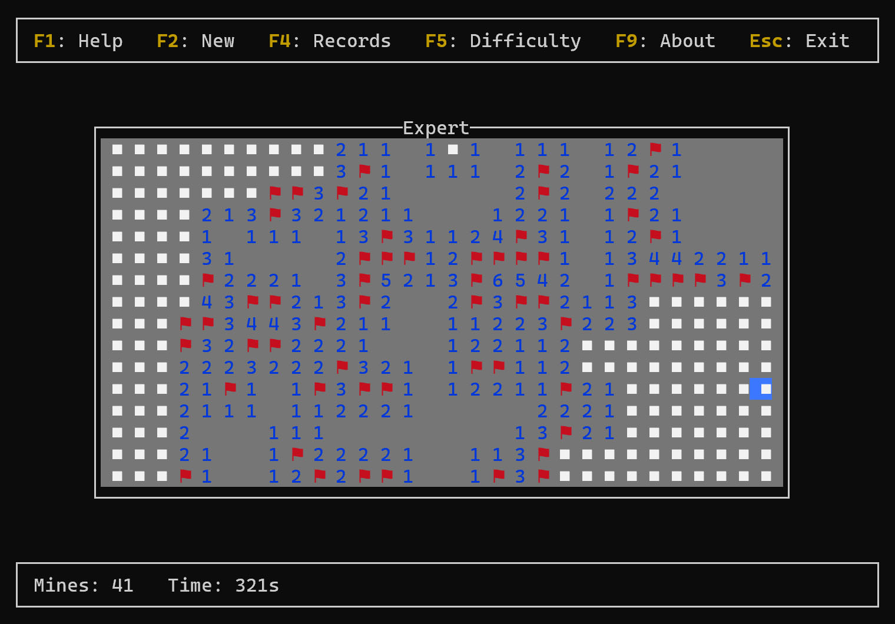

# About xtswpr

**A terminal-based classic Minesweeper game**  

[Download (Windows exe)](target/release/xtswpr.exe?raw=true)

---

## Introduction

This is a robust Minesweeper implementation written in Rust, designed for the Terminal environment. Built with TUI (Text User Interface) framework, it brings the nostalgic puzzle experience directly to your command line.

- Authentic Recreation: A near-perfect replica of the classic Windows Minesweeper, faithfully preserving the original mechanics, logic, and difficulty levels.
​
- TUI Graphics: Utilizes advanced terminal manipulation to deliver a clean, responsive, and visually appealing text-based interface.
​
- Classic Gameplay: Includes all the essential features you remember—left-click to reveal, right-click to flag, and "chording" (double-click) to clear areas quickly.

---

## Usage

Run the program in the command line terminal.

Both mouse and keyboard controls are supported.

Read HELP for gameplay instructions.

---

## License
This project is licensed under [MIT License](../LICENSE). All code in this repository are free to use, modify, and distribute under the terms of this license.

---

## Contact
**E-mail**: [Send Email](mailto:newxhbl@hotmail.com?subject=[RustApps]%20Inquiry)  
**Issues**: [Open Issue](../../../issues)  
